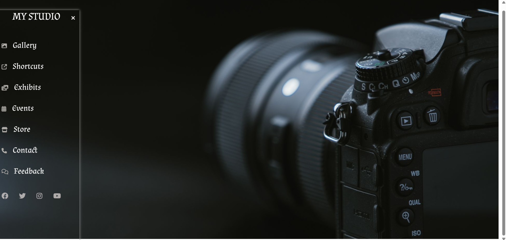

# responsive-sidebar-menu-css

# 🎨 Responsive Sidebar Navigation Menu

This is a simple, elegant, and responsive sidebar navigation menu built using **HTML**, **CSS**, and **Font Awesome** icons. It's perfect for portfolios, studios, galleries, or any website that requires a modern and clean sidebar layout.

---

## 📸 Preview

 <!-- Add a screenshot of your UI here -->

---

## 🛠️ Features

- Responsive sidebar toggle using a hidden checkbox
- Font Awesome icons for modern look
- Smooth sliding animation with CSS transitions
- Social media links section
- Custom Google Fonts (Almendra and Poppins)
- Background image customization
- Hover animations and effects

